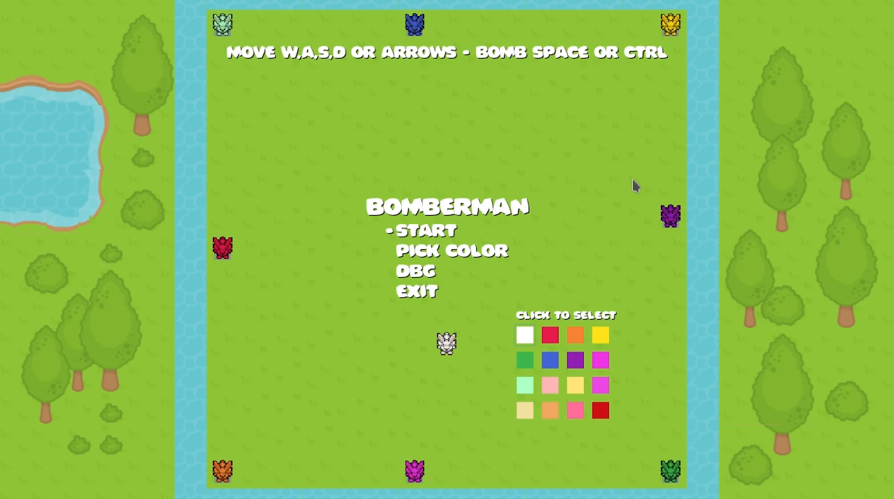
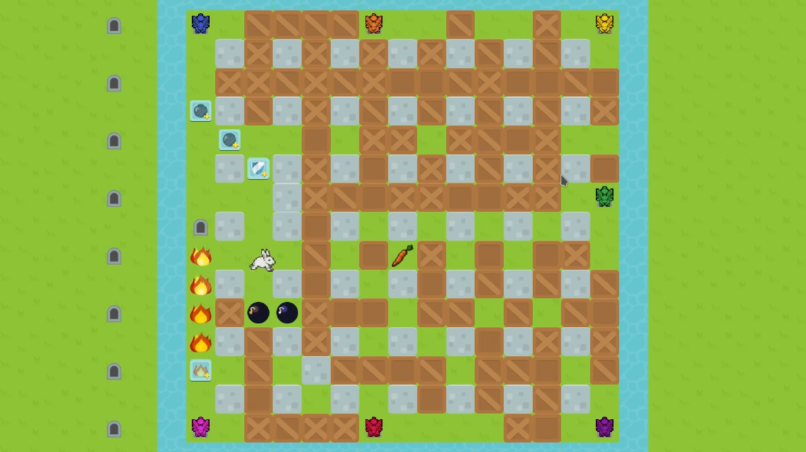

<!-- PROJECT LOGO -->
 

  

  <h3 align="center">Bomberman C# Godot</h3>
    <a href="https://soglahash.github.io/bomberman-godot/">Demo on Github Pages</a>

 

 

<!-- TABLE OF CONTENTS -->

  
Table of Contents

  <ol>
    <li>
      <a href="#about-the-project">About The Project</a>
      <ul>
        <li><a href="#requirements">Requirements</a></li>
        <li><a href="#built-with">Built With</a></li>
        <li><a href="#resources">Resources</a></li>
      </ul>
    </li>
    <li><a href="#roadmap">Roadmap</a></li>
    <li><a href="#license">License</a></li>
  </ol>

# Bomberman C# Godot
Bomberman implementation with C# Godot
Hosted on github pages 

Sample screenshots

## Built With
* 
* 

## Requirements
https://godotengine.org/download/linux

Mono version (C# Support)

## Resources
- color palette
https://lospec.com/palette-list/pear36
- sprite splicer
https://github.com/ForkandBeard/Alferd-Spritesheet-Unpacker

## Roadmap
v1.0.0
- [ ] Refactor Player and PlayerBot; to PlayerBase, Player and Enemy
- [ ] Basic AI without Nav2D
- [ ] Convert map 2D Map to tileset
- [ ] remove unused assets to improve load times
- [ ] update sound levels
- [ ] list other players on side 
- [ ] turn on/off flicker timer (player)
- [ ] place bombs using signals to game manager 
- [ ] create graveyard spawns that are named
    make graveyard fixed
- [ ] show names above players
- [ ] character model picker
- [ ] do not fizzle fire on ignite powerup, let fire continue on top of fire
- [ ] track score
------------------------------
v2.0.0
- [ ] Add bots
------------------------------
v3.0.0
-  [ ] Add multiplayer

<!-- LICENSE -->
## License
 This work is licensed under a <a rel="license" href="http://creativecommons.org/licenses/by-nc-sa/4.0/">Creative Commons Attribution-NonCommercial-ShareAlike 4.0 International License</a>.

[Python.org]: https://img.shields.io/badge/Python-14354C?style=for-the-badge&logo=python&logoColor=white
[Python-url]: https://www.python.org/
[React.js]: https://img.shields.io/badge/React-20232A?style=for-the-badge&logo=react&logoColor=61DAFB
[React-url]: https://reactjs.org/
[Bootstrap.com]: https://img.shields.io/badge/Bootstrap-563D7C?style=for-the-badge&logo=bootstrap&logoColor=white
[Bootstrap-url]: https://getbootstrap.com
[Electron.js]: https://img.shields.io/badge/Electron-191970?style=for-the-badge&logo=Electron&logoColor=white
[Electron-url]: https://www.electronjs.org/

[Twitch.com]: 	https://img.shields.io/badge/Twitch-9146FF?style=for-the-badge&logo=twitch&logoColor=white
[Twitch-url]:    https://twitch.com
[Youtube-url]:    https://youtube.com
[Youtube.com]: https://img.shields.io/badge/YouTube-FF0000?style=for-the-badge&logo=youtube&logoColor=white
[gui-screenshot]: https://github.com/SoglaHash/gui-compilation-from-cluster/raw/main/screenshot.png
[csharp]: https://img.shields.io/badge/C%23-239120?style=for-the-badge&logo=c-sharp&logoColor=white
